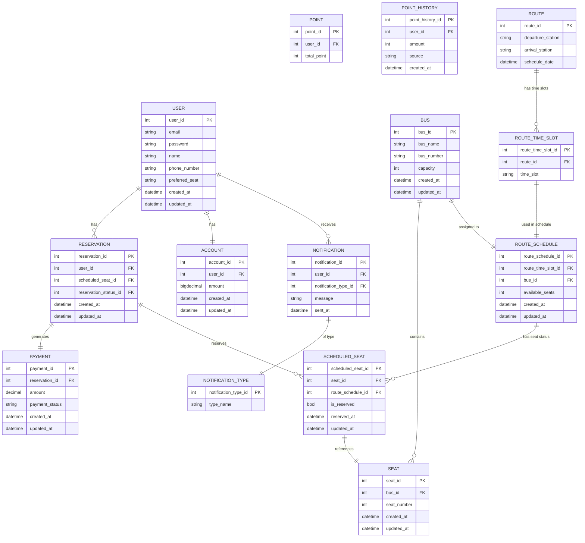

## ERDiagram

```mermaid
erDiagram
    USER {
        int user_id PK
        string email
        string password
        string name
        string phone_number
        string preferred_seat
        datetime created_at
        datetime updated_at
    }
    
    ACCOUNT {
        int account_id PK
        int user_id FK
        bigdecimal amount
        datetime created_at
        datetime updated_at
    }
    
    POINT {
        int point_id PK
        int user_id FK
        int total_point
    }
    
    POINT_HISTORY {
        int point_history_id PK
        int user_id FK
        int amount
        string source
        datetime created_at
    }

    RESERVATION {
        int reservation_id PK
        int user_id FK
        int scheduled_seat_id FK
        int reservation_status_id FK
        datetime created_at
        datetime updated_at
    }

    SEAT {
        int seat_id PK
        int bus_id FK
        int seat_number
        datetime created_at
        datetime updated_at
    }

    BUS {
        int bus_id PK
        string bus_name
        string bus_number
        int capacity
        datetime created_at
        datetime updated_at
    }

    ROUTE {
        int route_id PK
        string departure_station
        string arrival_station
        datetime schedule_date
    }

    ROUTE_TIME_SLOT {
        int route_time_slot_id PK
        int route_id FK
        string time_slot
    }

    ROUTE_SCHEDULE {
        int route_schedule_id PK
        int route_time_slot_id FK
        int bus_id FK
        int available_seats
        datetime created_at
        datetime updated_at
    }

    SCHEDULED_SEAT {
        int scheduled_seat_id PK
        int seat_id FK
        int route_schedule_id FK
        bool is_reserved
        datetime reserved_at
        datetime updated_at
    }

    PAYMENT {
        int payment_id PK
        int reservation_id FK
        decimal amount
        string payment_status
        datetime created_at
        datetime updated_at
    }

    NOTIFICATION {
        int notification_id PK
        int user_id FK
        int notification_type_id FK
        string message
        datetime sent_at
    }

    NOTIFICATION_TYPE {
        int notification_type_id PK
        string type_name
    }

    USER ||--o{ RESERVATION : "has"
    USER ||--|| ACCOUNT : "has"
    RESERVATION ||--|| PAYMENT : "generates"
    RESERVATION ||--o{ SCHEDULED_SEAT : "reserves"
    USER ||--o{ NOTIFICATION : "receives"
    NOTIFICATION ||--|| NOTIFICATION_TYPE : "of type"
    BUS ||--o{ SEAT : "contains"
    BUS ||--|| ROUTE_SCHEDULE : "assigned to"
    ROUTE ||--o{ ROUTE_TIME_SLOT : "has time slots"
    ROUTE_TIME_SLOT ||--|| ROUTE_SCHEDULE : "used in schedule"
    ROUTE_SCHEDULE ||--o{ SCHEDULED_SEAT : "has seat status"
    SCHEDULED_SEAT ||--|| SEAT : "references"
```