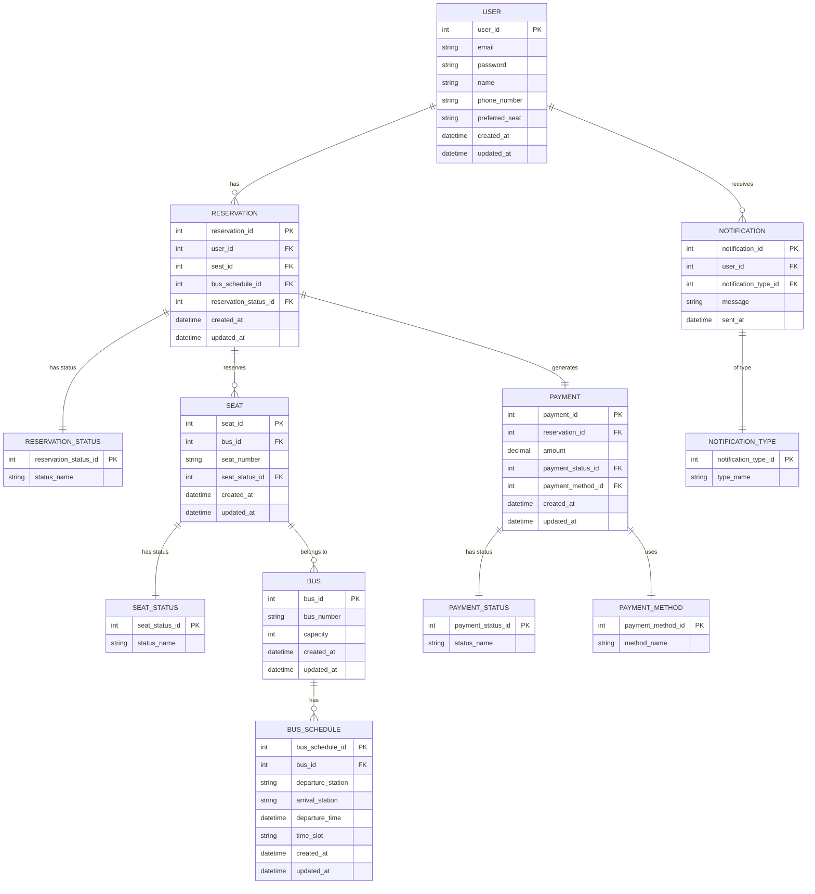

## ERDiagram

```mermaid
erDiagram
    USER {
        int user_id PK
        string email
        string password
        string name
        string phone_number
        string preferred_seat
        datetime created_at
        datetime updated_at
    }

    RESERVATION {
        int reservation_id PK
        int user_id FK
        int seat_id FK
        int bus_schedule_id FK
        int reservation_status_id FK
        datetime created_at
        datetime updated_at
    }

    RESERVATION_STATUS {
        int reservation_status_id PK
        string status_name
    }

    SEAT {
        int seat_id PK
        int bus_id FK
        string seat_number
        int seat_status_id FK
        datetime created_at
        datetime updated_at
    }

    SEAT_STATUS {
        int seat_status_id PK
        string status_name
    }

    BUS {
        int bus_id PK
        string bus_number
        int capacity
        datetime created_at
        datetime updated_at
    }

    BUS_SCHEDULE {
        int bus_schedule_id PK
        int bus_id FK
        string departure_station
        string arrival_station
        datetime departure_time
        string time_slot
        datetime created_at
        datetime updated_at
    }

    PAYMENT {
        int payment_id PK
        int reservation_id FK
        decimal amount
        int payment_status_id FK
        int payment_method_id FK
        datetime created_at
        datetime updated_at
    }

    PAYMENT_STATUS {
        int payment_status_id PK
        string status_name
    }

    PAYMENT_METHOD {
        int payment_method_id PK
        string method_name
    }

    NOTIFICATION {
        int notification_id PK
        int user_id FK
        int notification_type_id FK
        string message
        datetime sent_at
    }

    NOTIFICATION_TYPE {
        int notification_type_id PK
        string type_name
    }

    USER ||--o{ RESERVATION : "has"
    RESERVATION ||--|| PAYMENT : "generates"
    RESERVATION ||--o{ SEAT : "reserves"
    SEAT ||--o{ BUS : "belongs to"
    RESERVATION ||--|| RESERVATION_STATUS : "has status"
    SEAT ||--|| SEAT_STATUS : "has status"
    PAYMENT ||--|| PAYMENT_STATUS : "has status"
    PAYMENT ||--|| PAYMENT_METHOD : "uses"
    USER ||--o{ NOTIFICATION : "receives"
    NOTIFICATION ||--|| NOTIFICATION_TYPE : "of type"
    BUS ||--o{ BUS_SCHEDULE : "has"

```