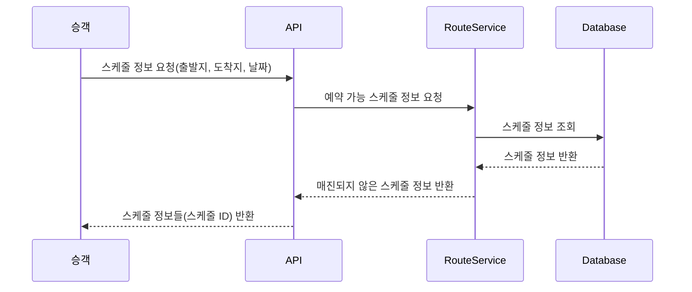
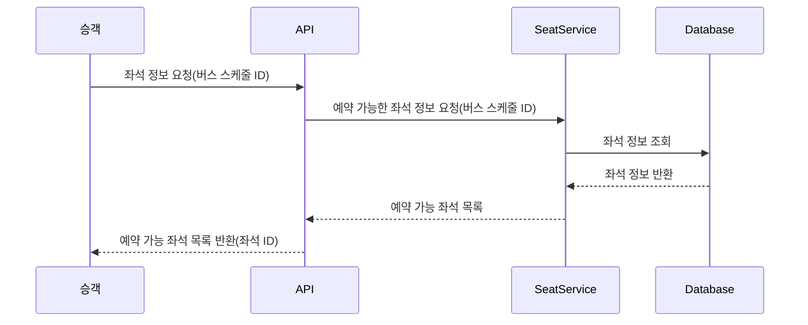
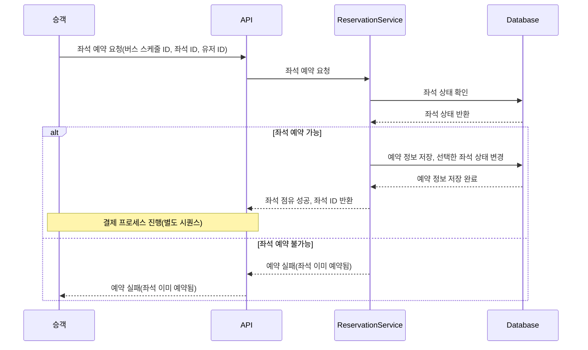
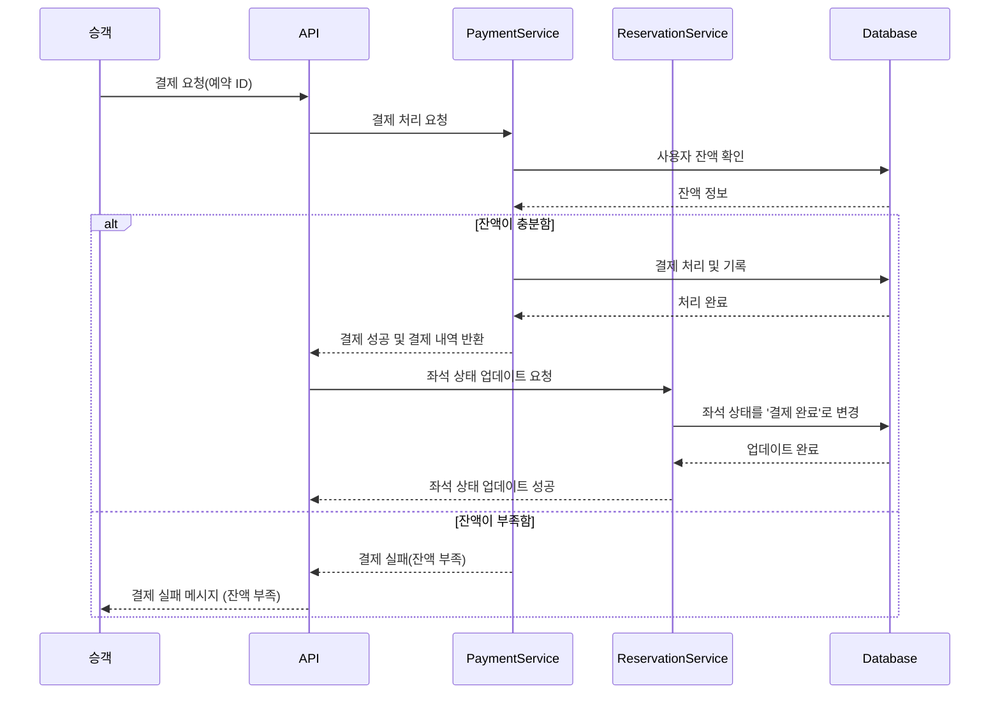
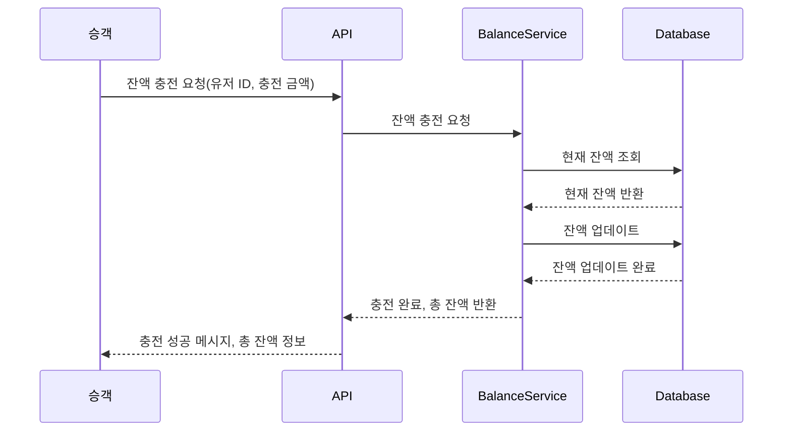
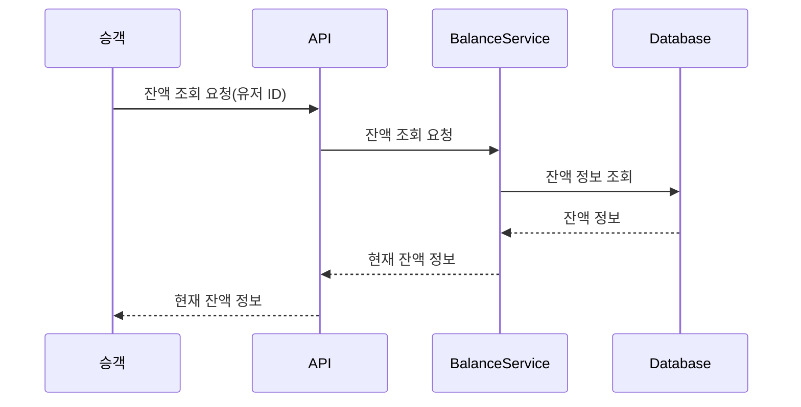

## 예약 가능 스케줄 조회

```mermaid
sequenceDiagram
    participant User as 승객
    participant API as API
    participant RouteService as RouteService
    participant DB as Database

    User ->> API: 스케줄 정보 요청(출발지, 도착지, 날짜)
    API ->> RouteService: 예약 가능 스케줄 정보 요청
    RouteService ->> DB: 스케줄 정보 조회
    DB -->> RouteService: 스케줄 정보 반환
    RouteService -->> API: 매진되지 않은 스케줄 정보 반환
    API -->> User: 스케줄 정보들(스케줄 ID) 반환

```
### Description

- 예약 가능한 스케줄의 정보를 조회합니다.

## 좌석 조회

```mermaid
sequenceDiagram
    participant User as 승객
    participant API as API
    participant SeatService as SeatService
    participant DB as Database

    User ->> API: 좌석 정보 요청(버스 스케줄 ID)
    API ->> SeatService: 예약 가능한 좌석 정보 요청(버스 스케줄 ID)
    SeatService ->> DB: 좌석 정보 조회
    DB -->> SeatService: 좌석 정보 반환
    SeatService -->> API: 예약 가능 좌석 목록
    API -->> User: 예약 가능 좌석 목록 반환(좌석 ID)

```

## 좌석 예약

```mermaid
sequenceDiagram
    participant User as 승객
    participant API as API
    participant ReservationService as ReservationService
    participant DB as Database

    User ->> API: 좌석 예약 요청(버스 스케줄 ID, 좌석 ID, 유저 ID)
    API ->> ReservationService: 좌석 예약 요청
    ReservationService ->> DB: 좌석 상태 확인
    DB -->> ReservationService: 좌석 상태 반환
    alt 좌석 예약 가능
        ReservationService ->> DB: 예약 정보 저장, 선택한 좌석 상태 변경
        DB -->> ReservationService: 예약 정보 저장 완료
        ReservationService -->> API: 좌석 점유 성공, 좌석 ID 반환
            Note over User, API: 결제 프로세스 진행(별도 시퀀스)
    else 좌석 예약 불가능
        ReservationService -->> API: 예약 실패(좌석 이미 예약됨)
        API -->> User: 예약 실패(좌석 이미 예약됨)
    end
```

### Description
- 좌석 점유 이후 5분이 지나면, 별도의 스케쥴러로 점유를 해제합니다.

## 결제

```mermaid
sequenceDiagram
    participant User as 승객
    participant API as API
    participant PaymentService
    participant ReservationService
    participant DB as Database

    User ->> API: 결제 요청(예약 ID)
    API ->> PaymentService: 결제 처리 요청
    PaymentService ->> DB: 사용자 잔액 확인
    DB -->> PaymentService: 잔액 정보
    alt 잔액이 충분함
        PaymentService ->> DB: 결제 처리 및 기록
        DB -->> PaymentService: 처리 완료
        PaymentService -->> API: 결제 성공 및 결제 내역 반환
        API ->> ReservationService: 좌석 상태 업데이트 요청
        ReservationService ->> DB: 좌석 상태를 '결제 완료'로 변경
        DB -->> ReservationService: 업데이트 완료
        ReservationService -->> API: 좌석 상태 업데이트 성공
    else 잔액이 부족함
        PaymentService -->> API: 결제 실패(잔액 부족)
        API -->> User: 결제 실패 메시지 (잔액 부족)
    end
```

## 잔액 충전

```mermaid
sequenceDiagram
    participant User as 승객
    participant API
    participant BalanceService
    participant DB as Database
    
    User ->> API: 잔액 충전 요청(유저 ID, 충전 금액)
    API ->> BalanceService: 잔액 충전 요청
    BalanceService ->> DB: 현재 잔액 조회
    DB -->> BalanceService: 현재 잔액 반환
    BalanceService ->> DB: 잔액 업데이트
    DB -->> BalanceService: 잔액 업데이트 완료
    BalanceService -->> API: 충전 완료, 총 잔액 반환
    API -->> User: 충전 성공 메시지, 총 잔액 정보
```

## 잔액 조회

```mermaid
sequenceDiagram
    participant User as 승객
    participant API
    participant BalanceService
    participant DB as Database
    
    User ->> API: 잔액 조회 요청(유저 ID)
    API ->> BalanceService: 잔액 조회 요청
    BalanceService ->> DB: 잔액 정보 조회
    DB -->> BalanceService: 잔액 정보
    BalanceService -->> API: 현재 잔액 정보
    API -->> User: 현재 잔액 정보
```